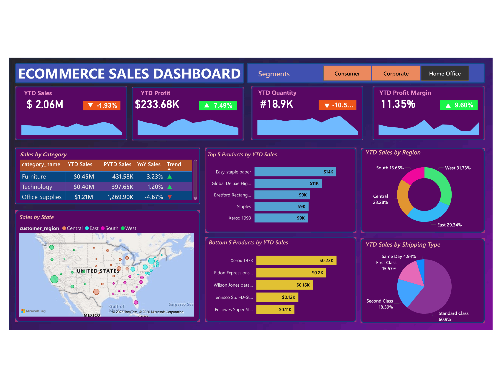

# 🛒 Ecommerce Sales Dashboard — Revenue, Profitability & Product Intelligence

> A Microsoft Power BI dashboard connected to a **PostgreSQL** backend, built to give ecommerce business leaders a real-time view of sales performance, profitability trends, product rankings, and regional distribution — enabling faster, evidence-based commercial decisions.


---

## 📌 Table of Contents

- [Business Problem](#-business-problem--objective)
- [Dashboard Preview](#-dashboard-preview)
- [Dataset Description](#-dataset-description)
- [Key Insights](#-key-insights)
- [Tools & Technologies](#️-tools--technologies)
- [DAX Measures & SQL Queries](#-dax-measures--sql-queries)
- [How to Use](#-how-to-use)
- [Author](#-author)

---

## 🎯 Business Problem & Objective

In ecommerce, the gap between **revenue and profitability** is often invisible until it's too late. A store can be growing in sales while quietly losing margin on underperforming SKUs, inefficient shipping choices, or declining regional demand.

This dashboard was built to answer the most pressing commercial questions facing ecommerce operations teams:

| Business Question | Dashboard Answer |
|---|---|
| Are we growing or declining vs. last year? | YTD vs. PYTD KPI cards with % variance indicators |
| Which product categories are driving — or dragging — revenue? | Sales by Category table with YoY trend arrows |
| Where are our most and least profitable products? | Top 5 and Bottom 5 Products by YTD Sales |
| Which regions represent the biggest opportunity? | YTD Sales by Region donut chart + US state map |
| Is our profit margin improving despite revenue softness? | YTD Profit Margin KPI — 11.35% (▲ 9.60%) |
| How are customers choosing to receive their orders? | YTD Sales by Shipping Type breakdown |
| Does performance differ across Consumer, Corporate, and Home Office? | Segment-level slicer filtering all visuals |

**Objective:** Provide sales, operations, and category management teams with a single source of truth for YTD commercial performance — surfacing risks and opportunities before they impact the bottom line.

---

## 📊 Dashboard Preview



> **Snapshot — Current Year Performance:**
> - YTD Sales: **$2.06M** (▼ -1.93% vs. prior year)
> - YTD Profit: **$233.68K** (▲ +7.49%)
> - YTD Quantity: **#18.9K** (▼ -10.5%)
> - YTD Profit Margin: **11.35%** (▲ +9.60%)
> - Segments: Consumer | Corporate | Home Office

---

## 🗂️ Dataset Description

The dataset is sourced from a **PostgreSQL database** representing a US-based ecommerce retailer with transactions across multiple product categories, regions, and customer segments.

| Column | Description | Type |
|---|---|---|
| `order_id` | Unique order identifier | VARCHAR |
| `order_date` | Date of transaction | DATE |
| `customer_id` | Unique customer identifier | VARCHAR |
| `customer_segment` | Consumer / Corporate / Home Office | CATEGORICAL |
| `customer_region` | Central / East / South / West | CATEGORICAL |
| `state` | US state of delivery | VARCHAR |
| `category_name` | Furniture / Technology / Office Supplies | CATEGORICAL |
| `product_name` | Individual product name | VARCHAR |
| `sales` | Revenue from the transaction (USD) | DECIMAL |
| `quantity` | Units sold | INTEGER |
| `discount` | Discount applied (0.0–1.0) | DECIMAL |
| `profit` | Net profit after costs and discounts | DECIMAL |
| `ship_mode` | Standard / Second / First Class / Same Day | CATEGORICAL |

**Data Source:** PostgreSQL database (connected live via Power BI DirectQuery / Import mode)
**Scope:** Multi-year transactional data | **Current Year Records:** ~5,000+ orders

---

## 💡 Key Insights

Insights are framed as business decisions, not just data observations — the standard expected at analyst and senior analyst levels.

### 📉 Revenue vs. Profitability Divergence — The Critical Story

1. **Revenue is down (-1.93% YTD) but profit is up (+7.49%)** — This counter-intuitive dynamic signals a deliberate or emerging shift: the business is selling less but at better margins. This could indicate successful discount reduction, a mix shift toward higher-margin products, or the elimination of loss-making SKUs. **Action:** Identify which categories drove the margin expansion and replicate the strategy.

2. **Office Supplies generates the highest revenue ($1.21M) but carries the worst YoY trend (-4.67%)** — Despite being the volume leader, this category is deteriorating fastest. With Furniture (+3.23%) and Technology (+1.20%) both growing year-over-year, a portfolio rebalancing strategy toward tech and furniture could protect overall revenue. **Action:** Audit Office Supplies pricing, competition exposure, and customer churn within this category.

3. **The West region leads with 31.73% of YTD sales** — outpacing East (29.34%), Central (23.28%), and South (15.65%). The South is dramatically underrepresented relative to its US population share. **Action:** Investigate whether this is a logistics gap, marketing underinvestment, or a genuine demand signal — and size the opportunity.

### 📦 Product Portfolio Insights

4. **Easy-staple paper ($14K) leads Top 5 by a wide margin** — a low-cost consumable commodity driving volume. This is likely a high-frequency, low-margin product. Its dominance in the top 5 suggests the assortment may be over-indexed on commodity items. **Action:** Cross-sell higher-margin products to frequent commodity buyers.

5. **The Bottom 5 products collectively generate under $1K in YTD sales** — Products like Fellowes Super St. ($0.11K) and Tennsco Stur-D-St. ($0.12K) are dead weight in the catalog. Carrying, marketing, and warehousing these SKUs has a real cost. **Action:** Flag for discontinuation or promotional clearance.

### 🚚 Shipping & Operational Insights

6. **Standard Class shipping dominates at 60.9%** — confirming customers prioritize cost over speed. However, Same Day (4.94%) and First Class (15.57%) together represent 20%+ of orders. **Action:** Analyze whether premium shipping customers have higher average order values or margins — if yes, they warrant a loyalty or upsell program.

---

## 🛠️ Tools & Technologies

| Tool | Purpose |
|---|---|
| **Microsoft Power BI Desktop** | Dashboard design, data modeling, and interactive visualizations |
| **PostgreSQL** | Primary data source — transactional ecommerce data |
| **Power Query (M Language)** | Data transformation, joins, and type casting post-SQL extraction |
| **DAX (Data Analysis Expressions)** | YTD, PYTD, YoY variance, profit margin calculations |
| **Bing Maps (Power BI)** | Geographic bubble map for state-level sales distribution |
| **Power BI Service** *(optional)* | Cloud publishing, scheduled refresh, and sharing |

---

## 🧮 DAX Measures & SQL Queries

### Core DAX Measures

```DAX
-- ─────────────────────────────────────────
-- 1. Year-to-Date Sales
-- ─────────────────────────────────────────
YTD Sales = TOTALYTD(SUM(ecommerce_data[sales_per_order]),
                    'Calendar'[Date])

-- ─────────────────────────────────────────
-- 2. Prior Year-to-Date Sales
-- ─────────────────────────────────────────
PYTD Sales = CALCULATE(sum(ecommerce_data[sales_per_order]),
                    DATESYTD(SAMEPERIODLASTYEAR('Calendar'[Date])))


-- ─────────────────────────────────────────
-- 3. Year-over-Year Sales Variance (%)
-- ─────────────────────────────────────────
YoY Sales % = ([YTD Sales]-[PYTD Sales])/[PYTD Sales]


-- ─────────────────────────────────────────
-- 4. YTD Profit
-- ─────────────────────────────────────────
YTD Profit = TOTALYTD(SUM(ecommerce_data[profit_per_order]), 'Calendar'[Date])


-- ─────────────────────────────────────────
-- 5. YTD Profit Margin (%)
-- ─────────────────────────────────────────
YTD Profit Margin = TOTALYTD([Profit Margin], 'Calendar'[Date])

-- ─────────────────────────────────────────
-- 6. YTD Quantity Sold
-- ─────────────────────────────────────────
YTD Qty = TOTALYTD(SUM(ecommerce_data[order_quantity]), 'Calendar'[Date])

-- ─────────────────────────────────────────
-- 7. YoY Profit Margin Variance
-- ─────────────────────────────────────────
YoY profit Margin = ([YTD Profit Margin]-[PYTD Profit Margin])/[PYTD Profit Margin]


-- ─────────────────────────────────────────
-- 8. Dynamic KPI Trend Color (Conditional)
-- ─────────────────────────────────────────
Sales Trend Color =
IF([YoY Sales %] >= 0, "Green", "Red")
```

---

## 🚀 How to Use

### For Recruiters & Viewers
The dashboard screenshot above provides a full visual overview. To explore the **interactive version**:

1. Download `Ecommerce_Sales_Dashboard.pbix` from the `/dashboard` folder
2. Open it using **[Power BI Desktop](https://powerbi.microsoft.com/desktop/)** (free)
3. Data is pre-embedded — no database connection required to view
4. Use the **Segment buttons** (Consumer / Corporate / Home Office) to filter all visuals
5. Click any chart element to cross-filter the entire report in real-time

> 💡 *To reconnect to a live PostgreSQL database: Go to Home → Transform Data → Data Source Settings and update the server credentials.*


---

## 📄 License

This project is licensed under the MIT License — see the [LICENSE](LICENSE) file for details.

---

## 👤 Author

**[ARSHAD K I SHAIKH]**
*Data Analyst | Power BI Developer | Ecommerce Analytics*

[](https://linkedin.com/in/arshadkishaikh/)
[](https://github.com/Arshadkishaikh)

---

> 💼 *This project demonstrates the full data analyst workflow — SQL extraction from PostgreSQL, data modeling in Power Query, advanced DAX time-intelligence measures, and business-insight-driven dashboard design in Power BI.*

> ⭐ If this project helped or inspired you, please consider giving it a star!
